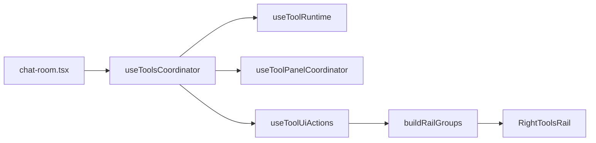

# Menambahkan Tool Baru ke IDA

Panduan langkah demi langkah untuk menambahkan tool baru ke sistem modular IDA v1.0.

---

## Dua Jalur Penambahan

| Jalur | Kapan dipakai | Contoh |
|-------|---------------|--------|
| **Placeholder** | Tool belum siap, hanya UI Coming Soon | Gambar, Video, Workflow |
| **Tool penuh** | Tool siap dengan panel & logic | Web Search, Map, Worksheet |

---

## Jalur A: Placeholder (Coming Soon)

Cukup untuk menampilkan icon di rail tanpa implementasi backend.

### 1. Tambahkan ID placeholder

`components/chat/tool-rail-config.ts`:

```typescript
export type ToolRailPlaceholderId =
  | "workflow"
  | "my-new-tool"   // ← tambahkan di sini
  // ...
```

### 2. Tambahkan label i18n

`lib/i18n.ts` — tambahkan key di type `Copy` dan ketiga locale (`id`, `en`, `zh`):

```typescript
toolsMyNewTool: "My New Tool",  // en
toolsMyNewTool: "Tool Baru",    // id
```

### 3. Tambahkan entry di grup rail

`components/chat/tool-rail-config.ts`:

```typescript
{
  id: "my-new-tool",
  labelKey: "toolsMyNewTool",
  icon: MyLucideIcon,
  comingSoon: true,
}
```

### 4. Update `isToolRailPlaceholder()`

```typescript
return (
  id === "workflow" ||
  id === "my-new-tool" ||  // ← tambahkan
  // ...
);
```

Selesai. Tool akan muncul di right rail dan tools menu. Klik menampilkan toast Coming Soon.

---

## Jalur B: Tool Penuh (Aktif)

### Checklist

- [ ] `types.ts` — tambah `ToolId`
- [ ] `registry.ts` — daftarkan tool (`enabled: true`)
- [ ] `tool-ui-config.ts` — ikon, label, `kind`, `panel`
- [ ] `tool-panel-ids.ts` — konstanta panel ID
- [ ] `lib/chat-tools.ts` — tambah ke `RightSidebarPanel`
- [ ] Folder modul `tools/<nama>/` — hook + panel + tool metadata
- [ ] `use-tool-runtime.ts` — daftarkan hook
- [ ] `tool-coordinator-config.ts` — entry runtime + availability
- [ ] `tool-panel-host.tsx` — render panel
- [ ] `tool-rail-config.ts` — entry di grup yang sesuai
- [ ] `ChatSession` — field persist (jika perlu)
- [ ] Migrasi Supabase — kolom persist (jika perlu)
- [ ] `lib/admin/types.ts` — `ToolModelKey` (jika butuh model khusus)
- [ ] `lib/chat-handler.ts` — logic server (jika tool mempengaruhi chat)
- [ ] i18n — semua label UI

---

## Langkah Detail

### 1. Definisikan ToolId

`components/chat/tools/types.ts`:

```typescript
export type ToolId = "worksheet" | "web-search" | "map" | "research" | "my-tool";
```

### 2. Daftarkan di registry

`components/chat/tools/registry.ts`:

```typescript
import { myTool } from "./my-tool/my-tool";

const tools: Record<ToolId, Tool> = {
  // ...
  "my-tool": myTool,
};
```

`my-tool-tool.ts`:

```typescript
export const myTool: Tool = {
  id: "my-tool",
  label: "My Tool",
  enabled: true,
};
```

### 3. Konfigurasi UI

`components/chat/tools/tool-ui-config.ts`:

```typescript
"my-tool": {
  icon: MyIcon,
  labelKey: "toolsMyTool",
  kind: "toggle-my-tool",  // atau "open-panel"
  panel: "my-tool",
  railPanel: "my-tool",
},
```

### 4. Panel ID

`lib/chat-tools.ts`:

```typescript
export type RightSidebarPanel =
  | "worksheet"
  | "web-search"
  | "map"
  | "research"
  | "my-tool";
```

### 5. Buat hook state

`components/chat/tools/my-tool/use-my-tool.ts`:

```typescript
export function useMyTool(): BaseToolState & BaseToolLifecycle & {
  // state khusus tool
} {
  const [isEnabled, setIsEnabled] = useState(false);
  const [isPanelOpen, setIsPanelOpen] = useState(false);

  const { setEnabled, openPanel, closePanel, toggleTool } =
    createBaseToolActions({ setIsEnabled, setIsPanelOpen, onDisable: reset });

  const hydrate = useCallback((state: ToolHydrationInput) => {
    applyBaseHydration(state, { setIsEnabled, setIsPanelOpen });
    // restore data khusus
  }, []);

  const resetForNewChat = useCallback(() => {
    resetBaseToolState({ setIsEnabled, setIsPanelOpen });
  }, []);

  return {
    panelId: "my-tool",
    isEnabled, isPanelOpen,
    setEnabled, toggleTool, openPanel, closePanel,
    hydrate, resetForNewChat,
  };
}
```

### 6. Buat panel UI

`components/chat/tools/my-tool/my-tool-panel.tsx` — komponen sidebar kanan.

### 7. Daftarkan di runtime

`components/chat/tools/use-tool-runtime.ts` — tambahkan hook ke bundle.

`components/chat/tools/tool-coordinator-config.ts` — tambahkan entry dengan `isAvailable`.

### 8. Render di panel host

`components/chat/tools/tool-panel-host.tsx`:

```typescript
if (panel === "my-tool") {
  return <MyToolPanel locale={locale} onClose={onClose} ... />;
}
```

### 9. Tambahkan ke rail config

`components/chat/tool-rail-config.ts` — entry **tanpa** `comingSoon`:

```typescript
{ id: "my-tool", labelKey: "toolsMyTool", icon: MyIcon, panel: "my-tool" },
```

### 10. Persist state sesi (opsional)

Jika tool perlu state antar reload:

1. Tambahkan field di `ChatSession` (`lib/chat-store.ts`)
2. Update `getPersistPatch()` di `use-tool-persistence.ts`
3. Update `hydrateFromChat()` di coordinator
4. Buat migrasi Supabase jika disimpan server-side

Contoh field yang sudah ada: `webSearchEnabled`, `researchEnabled`, `mapViewState`, `worksheet`.

### 11. Integrasi server (opsional)

Jika tool mempengaruhi respons chat:

1. Tambahkan flag di `IdaChatHandlerInput` (`lib/chat-handler.ts`)
2. Handle di `prepareIdaChatContext()`
3. Tambahkan ke payload client (`lib/client/chat-api-payload.ts`)
4. Tambahkan `resolveSendFlags` di coordinator

### 12. Model per tool (opsional)

Jika tool butuh model LLM khusus:

1. Tambahkan key di `ToolModelKey` (`lib/admin/types.ts`)
2. Tambahkan ke `TOOL_MODEL_KEYS` array
3. Tambahkan label di `components/admin/agent-models-tab.tsx`
4. Panggil `resolveToolModel(config, "myToolKey")` di handler

---

## Diagram Alur Coordinator



`chat-room.tsx` **tidak boleh** memanggil hook tool individual secara langsung.

---

## Testing

Setelah menambahkan tool:

```bash
npx tsc --noEmit
npm run build
```

Uji manual:

1. Tool muncul di right rail (grup yang benar)
2. Klik membuka panel kanan
3. Toggle armed → kirim pesan → flag terkirim ke API
4. Ganti sesi chat → state ter-restore
5. New chat → state ter-reset
6. Mobile tools menu → tool tampil dengan grouping benar

---

## Referensi Implementasi

Gunakan tool existing sebagai template:

| Tool | Kompleksitas | File referensi |
|------|-------------|----------------|
| Web Search | Sedang | `tools/web-search/` |
| Map | Sedang | `tools/map/` |
| Research | Tinggi | `tools/research/` |
| Worksheet | Tinggi | `tools/worksheet/` |

Dokumentasi modul internal: `components/chat/tools/README.md`.