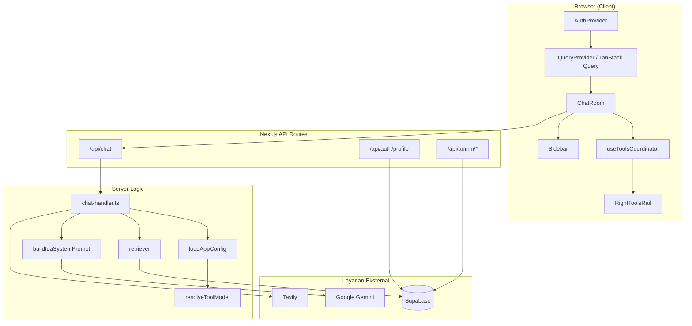

# Arsitektur IDA AI v1.0

Dokumen ini menjelaskan arsitektur teknis IDA: bagaimana komponen-komponen utama saling berinteraksi, bagaimana tool dikelompokkan, dan bagaimana model dipilih saat runtime.

---

## Gambaran Umum



---

## Route Groups & Provider Tree

IDA memisahkan route publik dan route aplikasi menggunakan **Route Group** Next.js:

```
app/
├── (public)/     → Tanpa AuthProvider wajib
├── (app)/        → Membungkus AuthProvider + QueryProvider
│   ├── chat/
│   ├── account/
│   └── agent/
└── admin/        → Autentikasi terpisah (ADMIN_PASSWORD)
```

### `AppProviders`

File `components/providers/app-providers.tsx` membungkus segment `(app)`:

```tsx
<AuthProvider>
  <QueryProvider>{children}</QueryProvider>
</AuthProvider>
```

| Provider | Tanggung jawab |
|----------|----------------|
| **AuthProvider** | Session Supabase, `signInWithGoogle`, `signOut`, hook `useAuth()` |
| **QueryProvider** | TanStack Query client dengan `staleTime` 5 menit |

Auth **tidak** membungkus halaman publik (`/`) agar landing page tetap ringan. Chat, account, dan agent berada di dalam `(app)` sehingga state auth tersedia secara konsisten.

---

## AuthProvider

`components/auth/auth-provider.tsx` mengelola autentikasi Google OAuth:

1. Saat mount, memanggil `supabase.auth.getSession()`
2. Berlangganan `onAuthStateChange` untuk update real-time
3. `signInWithGoogle()` → redirect ke `/auth/callback?next=...`
4. `signOut()` → clear session + redirect ke `/`

Profil pengguna (nama, avatar, custom prompt) **tidak** disimpan di AuthProvider. Profil di-fetch terpisah melalui TanStack Query (`useUserProfile`) agar cache dapat di-invalidate tanpa reload halaman penuh.

---

## TanStack Query & Caching Strategy

### Profil pengguna

| Aspek | Nilai |
|-------|-------|
| Query key | `USER_PROFILE_QUERY_KEY` (`lib/auth/user-profile-query.ts`) |
| `staleTime` global | 5 menit |
| `gcTime` | 30 menit |
| `refetchOnWindowFocus` | `false` |

Setelah update profil atau avatar, mutation memanggil `queryClient.setQueryData()` langsung (optimistic cache update) lalu `refreshSession()` Supabase.

### Konfigurasi admin (`loadAppConfig`)

Server-side memory cache dengan TTL **15 detik** (`lib/admin/config.ts`):

- Mengurangi query berulang ke tabel `ida_app_config`
- Admin panel memanggil `bypassCache: true` saat load config untuk data terbaru
- `invalidateAppConfigCache()` tersedia setelah save

### Chat sessions

Riwayat chat disimpan di Supabase (`ida_chat_sessions`) dan di-cache di client melalui chat store lokal. Tool state (panel aktif, flag enabled) di-persist per sesi.

---

## Sistem Tool Modular

### Lapisan arsitektur

```
tool-rail-config.ts     → Definisi grup & entry rail (UI statis)
registry.ts             → Tool aktif yang terdaftar (enabled/disabled)
tool-ui-config.ts       → Ikon, label i18n, perilaku menu
use-<tool>.ts             → Hook state per tool (BaseToolState)
use-tools-coordinator.ts  → Orkestrasi semua tool
tool-panel-host.tsx       → Render panel sidebar kanan
```

`chat-room.tsx` hanya berinteraksi dengan **`useToolsCoordinator`**, bukan hook individual.

### Tool aktif vs placeholder

| Tipe | Contoh | Perilaku |
|------|--------|----------|
| **Tool aktif** | `web-search`, `research`, `map`, `worksheet`, `workflow` | Terdaftar di `registry.ts`, punya hook + panel |
| **Placeholder** | `image`, `video`, `music`, `coding`, dll. | Hanya di `tool-rail-config.ts`, `comingSoon: true` |

Placeholder tidak memerlukan hook atau panel — cukup entry di config rail.

---

## Tool Grouping (Right Tools Rail)

Konfigurasi grup berada di `components/chat/tool-rail-config.ts`:

| Grup | ID | Tool |
|------|-----|------|
| **Riset** | `research` | Web Search, Map, Research |
| **Produktivitas** | `productivity` | Worksheet, Workflow |
| **Kreatif** | `creative` | Gambar, Video, Musik (Coming Soon) |
| **Lanjutan** | `advanced` | Coding, Integration, Virtual Computer (Coming Soon) |

### Alur render rail

1. `buildRailGroups()` (`coordinator-helpers.ts`) membaca `TOOL_RAIL_GROUPS`
2. Untuk setiap entry, cek apakah tool aktif (`registry`) atau placeholder
3. `RightToolsRail` merender per grup dengan separator visual
4. Placeholder **dapat diklik** → toast `"[Nama Tool] — Segera hadir"` via `notifyToolComingSoon()`

Mobile composer menggunakan `ToolsMenu` dengan grouping yang sama.

### BaseToolState (kontrak hook)

Setiap tool hook mengimplementasikan:

| Property / Method | Tujuan |
|-------------------|--------|
| `panelId` | ID panel sidebar kanan |
| `isEnabled` | Tool "armed" — aktif saat kirim pesan |
| `isPanelOpen` | Panel sedang terbuka |
| `setEnabled()` | Set armed state |
| `hydrate()` / `resetForNewChat()` | Restore / reset state sesi |

Coordinator mengatur **eksklusivitas panel** — hanya satu panel aktif dalam satu waktu.

### Workflow Tool (Fase 1–3)

Alur data mengikuti pola Worksheet (SSOT + persist layer):

```
Panel (workflow-panel.tsx)
  → useWorkflow (mutasi nodes/edges, executeWorkflow)
    → syncToPersistLayer()
      → useWorkflowWorkspace.setWorkflowWorkspaceInbound()
        → ChatSession.workflow
```

**Generasi dari chat** (tool armed):

1. Client mengirim `workflow: true` ke `/api/chat`
2. `buildWorkflowPromptSection()` menambahkan instruksi penanda `<<<IDA_WORKFLOW>>>`
3. `parseWorkflowFromResponse()` mengekstrak JSON workflow dari respons LLM
4. SSE `done.workflow` → `stream-tool-bridge.onWorkflowDone()` → `importWorkflowFromStream()`

**Eksekusi backend**:

```
POST /api/workflow/execute
  → lib/workflow-executor.ts (sort nodes, run LLM per step)
    → resolveToolModel("workflow", "agent")
```

Hasil eksekusi (status, logs per node, output) disimpan di `WorkflowWorkspace.lastExecution`.

### Workflow Phase 3 (Advanced)

#### 3.1 Multi-agent orchestration

- `lib/agent/multi-agent/` — specialist agents (research, coding, analysis, …)
- `runMultiAgentWorkflowStep()` dipanggil dari `lib/workflow-executor.ts` untuk node action/condition/output
- Aktivitas agent di-stream ke client via SSE `agent_activity`

#### 3.2 Admin analytics

- `lib/admin/workflow-analytics.ts` — agregasi eksekusi dari log permintaan
- UI: `components/admin/workflow-analytics-dashboard.tsx`
- Route: `GET /api/admin/workflow-analytics`

#### 3.3 Security & permissions

- `lib/workflow-security/` — visibility (`private` | `shared` | `company`), roles (`owner` | `editor` | `viewer`)
- Multi-level approval: `approval-hierarchy.ts` + checkpoint `approvalState`
- Audit: `ida_workflow_audit_logs` (migration 020)
- API: `PATCH /api/workflow/security`, `GET /api/workflow/audit`, `GET /api/admin/workflow-audit`

#### 3.4 Scheduling & triggers

- `lib/workflow-scheduler/` — cron-like schedules, delay, event triggers
- Tabel: `ida_workflow_schedules`, `ida_workflow_trigger_events` (migration 021)
- API: `POST /api/workflow/schedule`, `POST /api/workflow/trigger/webhook`, `POST /api/workflow/scheduler/tick`
- Admin: tab **Triggers** (`components/admin/workflow-triggers-tab.tsx`)
- pg_cron (opsional): panggil tick endpoint setiap menit dengan `WORKFLOW_SCHEDULER_SECRET`

#### 3.5 Polish & optimization

| Area | Implementasi |
|------|----------------|
| **Performance** | Lazy-load React Flow, template gallery, security panel; `onlyRenderVisibleElements` untuk graf besar; query Supabase tanpa `workflow_snapshot` di list |
| **Mobile** | `useIsMobileViewport()` — toggle Kanvas/Properti, MiniMap disembunyikan, touch zoom/pan |
| **Error feedback** | `lib/workflow-feedback.ts` — pesan i18n untuk execute/resume/rate-limit/network |
| **Tests** | `npm run test:workflow-all` — 8 skrip workflow |

```
lib/workflow-feedback.ts     → resolveWorkflowErrorMessage / resolveWorkflowExecutionToast
components/chat/tools/
  workflow-panel.tsx         → memo, dynamic imports, mobile editor tabs
  workflow-canvas.tsx        → memo nodes, error boundary + retry
```

---

## Runtime Model Selection (`toolModels`)

Admin dapat mengatur model LLM berbeda per tool melalui field `toolModels` di `IdaAppConfig`.

### Key yang tersedia

```typescript
type ToolModelKey =
  | "webSearch"
  | "research"
  | "workflow"
  | "agent"
  | "coding"
  | "integration"
  | "virtualComputer";
```

### Resolver

`lib/admin/tool-model.ts`:

```typescript
resolveToolModel(config, key, ...fallbackKeys)
```

Logika:
1. Cek `config.toolModels[key]` — jika ada (non-null), gunakan
2. Coba `fallbackKeys` berurutan
3. Fallback ke `config.defaultModel`

### Pemakaian di runtime

| Konteks | Key yang dipakai |
|---------|------------------|
| Chat biasa | `defaultModel` |
| Chat + Web Search aktif | `webSearch` |
| Chat + Research aktif | `research` (prioritas di atas web search) |
| Agent workflow proposal | `workflow` → fallback `agent` |

Implementasi di `lib/chat-handler.ts` (`prepareIdaChatContext`):

```typescript
const selectedModel =
  researchActive
    ? resolveToolModel(appConfig, "research")
    : webSearchActive
      ? resolveToolModel(appConfig, "webSearch")
      : appConfig.defaultModel;
```

Model aktif dikirim ke client melalui SSE meta event (`activeModel`, `activeProvider`).

---

## Alur Chat (Server)

```
POST /api/chat
  → rate limit check
  → prepareIdaChatContext()
      → loadAppConfig()
      → resolveToolModel() (jika tool aktif)
      → retrieveContext() (RAG, jika enabled)
      → prefetch web search / research (jika armed)
      → getIdaUserCustomPrompt() (jika userId ada)
      → buildIdaSystemPrompt()
  → runIdaChatStream() (SSE token + meta + done)
  → logRequest() ke ida_request_logs
```

### Fallback model

Jika stream gagal dan `fallbackModel` dikonfigurasi, chat route mencoba ulang dengan model fallback (lihat `app/api/chat/route.ts`).

---

## Custom Prompt di System Prompt

Custom prompt pengguna di-inject ke `buildIdaSystemPrompt()` sebagai section **"Preferensi Pengguna"**, setelah RAG dan tool context. Hanya berlaku untuk pengguna yang login (`userId` tersedia).

Lihat [CUSTOM_PROMPT.md](./CUSTOM_PROMPT.md) untuk detail.

---

## Admin Panel

Autentikasi terpisah dari Supabase Auth:

- Password-based via `ADMIN_PASSWORD` env var
- Session cookie HTTP-only (`lib/admin/auth.ts`)
- Tidak memerlukan login Google

Konfigurasi disimpan di tabel `ida_app_config` (key: `app_settings`).

---

## Database (Supabase)

| Tabel / fitur | Fungsi |
|---------------|--------|
| `ida_users` | Profil pengguna, `custom_prompt`, `last_login_at` |
| `ida_chat_sessions` | Sesi chat + tool state persist |
| `ida_app_config` | Konfigurasi admin (model, fitur, toolModels) |
| `ida_documents` + pgvector | Knowledge base RAG |
| `ida_request_logs` | Log request & token usage |

Migrasi ada di `supabase/migrations/`. Jalankan `supabase/apply-all.sql` atau terapkan migrasi berurutan.

---

## AgentFlow AI (`/agent`)

Halaman agent terpisah dari chat utama:

- Orchestrasi LangGraph (`lib/agent/orchestration/`)
- Proposal workflow via LLM (`proposal-generator.ts` → `resolveToolModel("workflow", "agent")`)
- Sandbox E2B opsional (`E2B_API_KEY`)
- Checkpointer Redis opsional (`UPSTASH_REDIS_REST_URL`)

Sidebar chat **tidak** menampilkan tab Agent — navigasi ke `/agent` terpisah.

---

## Keamanan & Rate Limiting

- Rate limit chat: `rate-limiter-flexible` (10 request / 60 detik per IP/session)
- Admin route: `requireAdmin()` guard
- Auth profile: hanya user yang login dapat PATCH profil sendiri
- Redirect OAuth: `resolveAuthRedirect()` membatasi path yang diizinkan

---

## Referensi Kode Utama

| File | Peran |
|------|-------|
| `components/auth/auth-provider.tsx` | OAuth Google |
| `components/chat/tools/use-tools-coordinator.ts` | Orkestrasi tool |
| `components/chat/tool-rail-config.ts` | Grouping rail |
| `lib/chat-handler.ts` | Server chat logic |
| `lib/admin/tool-model.ts` | Model resolver |
| `lib/admin/config.ts` | App config + cache |
| `lib/system-prompt.ts` | System prompt builder |