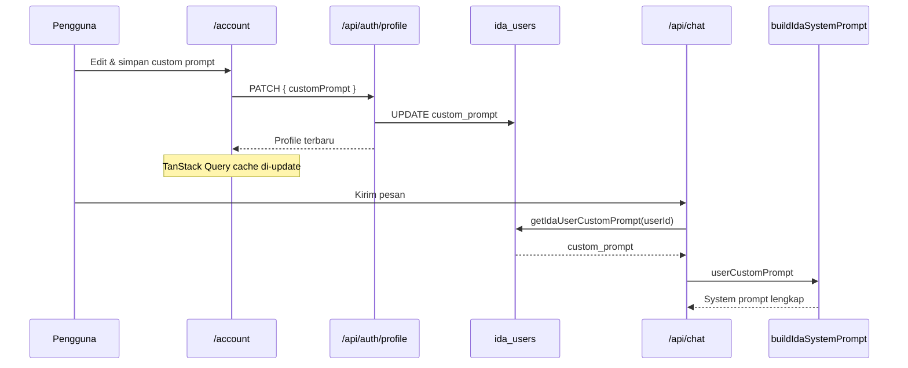

# Custom Prompt

Custom Prompt memungkinkan setiap pengguna menyesuaikan gaya respons IDA sesuai preferensi pribadi — tanpa mengubah system prompt global yang dikelola admin.

---

## Ringkasan

| Aspek | Detail |
|-------|--------|
| **Lokasi UI** | `/account` → section "Gaya Respons & Kepribadian" |
| **Batas karakter** | Maksimum 2.000 karakter |
| **Penyimpanan** | Kolom `custom_prompt` di tabel `ida_users` (Supabase) |
| **Auth** | Wajib login Google |
| **Dampak** | Di-inject ke system prompt setiap request chat |

---

## Cara Menggunakan (Pengguna)

1. Login dengan Google di `/chat`
2. Buka **`/account`** (tombol profil di header)
3. Temukan section **Custom Prompt**
4. Tulis instruksi preferensi, contoh:
   - *"Gunakan bahasa santai seperti teman dekat"*
   - *"Selalu jawab dalam bahasa Inggris formal"*
   - *"Fokus pada solusi praktis, hindari penjelasan panjang"*
5. Klik **Simpan**
6. Custom prompt berlaku untuk semua chat berikutnya

Untuk menghapus, kosongkan field dan simpan (atau hapus semua teks lalu simpan — field kosong disimpan sebagai `null`).

---

## Contoh Custom Prompt

| Tujuan | Contoh |
|--------|--------|
| Gaya santai | "Balas dengan nada hangat dan santai, seperti ngobrol dengan teman." |
| Formal | "Gunakan bahasa Indonesia baku dan profesional dalam setiap respons." |
| Ringkas | "Jawab maksimal 3 paragraf. Langsung ke inti." |
| Domain spesifik | "Saya adalah dosen teknik. Jelaskan konsep dengan analogi engineering." |
| Multibahasa | "Always respond in English unless I write in Indonesian." |

---

## Cara Kerja (Teknis)

### Alur data



### Penyimpanan database

Migrasi `017_user_profile_prefs.sql` menambahkan kolom:

```sql
custom_prompt TEXT
```

### API

**GET/PATCH** `/api/auth/profile`

```typescript
// PATCH body (Zod)
{
  fullName?: string;
  avatarUrl?: string | null;
  customPrompt?: string | null;  // max 2000 karakter
}
```

### Server-side injection

`lib/chat-handler.ts`:

```typescript
const userCustomPrompt = userId
  ? await getIdaUserCustomPrompt(userId).catch(() => null)
  : null;

buildIdaSystemPrompt(locale, {
  // ...
  userCustomPrompt,
});
```

### Format di system prompt

`lib/system-prompt.ts` menambahkan section:

```markdown
## Preferensi Pengguna (Custom Prompt)
Ikuti preferensi gaya respons berikut dari pengguna.
Prioritaskan instruksi ini selama tidak bertentangan dengan
batasan keamanan dan kebijakan IDA.

[user custom prompt text]
```

Section ini hanya ditambahkan jika `custom_prompt` tidak kosong.

---

## Client-side Cache

Profil (termasuk custom prompt) di-cache via TanStack Query:

| Hook | Fungsi |
|------|--------|
| `useUserProfile()` | Baca profil + custom prompt |
| `useUserProfileMutations()` | Update profil |
| `useUserCustomPrompt()` | Shortcut: return prompt string atau null |

Setelah simpan, cache di-update langsung (`setQueryData`) tanpa refetch penuh.

---

## Prioritas Instruksi

Urutan prioritas (tinggi → rendah):

1. **Kebijakan keamanan IDA** — tidak dapat di-override
2. **System prompt override admin** — jika diset di admin Settings
3. **Custom prompt pengguna** — preferensi gaya
4. **Konteks tool** — RAG, web search, research, worksheet
5. **Instruksi default IDA** — personality & behavior dasar

Custom prompt **tidak** mengganti kemampuan tool atau knowledge base.

---

## Keterbatasan

| Keterbatasan | Alasan |
|--------------|--------|
| Hanya untuk user login | `userId` diperlukan di chat handler |
| Max 2.000 karakter | Mencegah prompt injection berlebihan |
| Tidak mempengaruhi Agent | AgentFlow (`/agent`) tidak membaca custom prompt |
| Tidak per-sesi | Satu prompt global per akun, bukan per chat |
| Anonymous chat | Pengguna tanpa login tidak punya custom prompt |

---

## Keamanan

- Input divalidasi Zod (`max(2000)`) di API
- Trim whitespace; string kosong → `null`
- Custom prompt di-fetch server-side (tidak dari client payload chat)
- Tidak diekspos ke pengguna lain

---

## Troubleshooting

| Masalah | Solusi |
|---------|--------|
| Simpan gagal | Pastikan login; cek migrasi `017` sudah dijalankan |
| Prompt tidak berpengaruh | Pastikan chat dilakukan setelah login (bukan anonymous) |
| Perubahan tidak langsung terasa | Tidak perlu reload — request chat berikutnya sudah pakai prompt baru |
| Field disabled | Tombol simpan aktif jika ada teks di field |